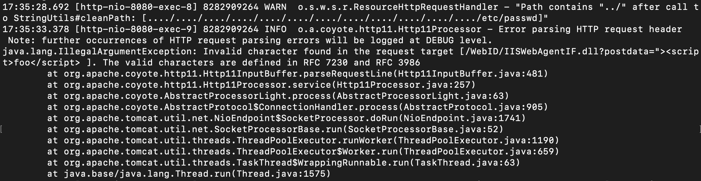
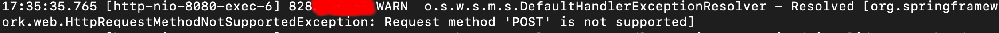

## Prod Ops

Applications are running in docker containers. 'webapp' is prod, 'staging' is test.
Whether they are connected to airtable is controlled by environment variables.
Staging connects to DB `wnc_helene_test` while webapp connects to the DB `wnc_helene`
All environment variables are in the redeploy sripts in `/root`


### QuickStart

`ssh [last-name]@wnc-supply-sites.com`

Connnect to the database with:
`sudo -u postgres psql`

Check logs with:
`docker logs -f webapp`

Restart staging with:
`/root/staging-redeploy.sh`

check staging logs:
`docker logs -f staging`

### DB Quickstart

Connect to database
```
sudo -u postgres psql
\c wnc_helene
```

View tables: `\d`
View columns of a table: `\d [table name]`


### Folders with local git

'git init' was run in the following folders to keep track of configs locally via git.

```
/root
/etc/nginx/
```

### DB Access
```
sudo -u postgres psql
\c wnc_helene
\c wnc_helene_test
```


### Logs

- Tail application logs
```bash
docker logs -f webapp
```

- Tail nginx access logs (can be used to gauge if there are active users in the system)
```bash
sudo tail -f /var/log/nginx/access.log
```

Database logs:
```
tail -200 /var/log/postgresql/postgresql-16-main.log
```


### IP address blocking

If scrapers are putting too much load on the system (or generally doing their scraping thing),
as can be observed from the NGINX access log - they can be blocked by running:

```
sudo /root/block-ip.sh [IP]
```
EG:
```
sudo /root/block-ip.sh 123.10.0.0
```


### DB Updates

Check for the  'schema/' folder
https://github.com/DanVanAtta/wnc-supply-sites/tree/master/schema

Create a new file in there and put the SQL commands in there.

Then run: `./schema/run-flyway.sh`
That will apply all new migrations to your local test database "wnc_helene_test",
and to "wnc_helene"

In production, flyway is automatically run as part of the 'redeploy' scripts.


### How to Rollback:

Do a revert to rollback commits. Push to master. Repeat the deployment
process. Document any rollback SQL updates in a new schema migration
file (`/schem`a` folder)


### Linux User setup: Adding SSH user with sudo

* Requires a public SSH key
* Requires pre-existing access to the server
* Access granted provides full sudo

```bash
# Set these two variables:

USERNAME=[last name of user here, all lower case, no spaces]
PUBLIC_SSH_KEY="[add public key here, do use double quotes around it]"


# Now run the following, (can copy paste and run everything below):

## Create user with home folder
sudo useradd $USERNAME
sudo chsh -s /usr/bin/bash $USERNAME
sudo mkdir -p /home/$USERNAME/.ssh/

## Set up the SSH key for access
sudo chmod 0700 /home/$USERNAME/.ssh/ 
echo "$PUBLIC_SSH_KEY" | sudo tee /home/$USERNAME/.ssh/authorized_keys
sudo chmod 0600 /home/$USERNAME/.ssh/authorized_keys
sudo chown -R $USERNAME:$USERNAME /home/$USERNAME

## Enable sudo for the user
sudo cp /root/template-sudoers-file /root/$USERNAME
sudo sed -i "s/^USERNAME/$USERNAME/" /root/$USERNAME
sudo mv -v /root/$USERNAME /etc/sudoers.d/


# Add user to 'docker' group, allows for 'docker' commands
# to be run without sudo
usermod -a -G docker $USERNAME
```


## Prod Setup/Install


### System setup

```bash

apt update
apt upgrade
ufw allow 80
ufw allow ssh
ufw enable

apt install nginx -y
apt install postgresql -y
apt install fail2ban -y

curl -fsSL https://get.docker.com/ | sh
useradd webapp
usermod -a -G docker webapp
```

### Create DB

```bash
sudo -u postgres psql
create database wnc_helene;
create user wnc_helene with password '....';
alter database wnc_helene owner to wnc_helene;

create database wnc_helene_test;
alter database wnc_helene_test owner to wnc_helene;
```


### DB dump (data seeding)

```
pg_dump -U postgres wnc_helene > db-dump.sql
scp db-dump.sql root@wnc-supply-sites.com

ssh root@wnc-supply-sites.com
sudo -u postgres psql wnc_helene < db-dump.sql
```

DB dump from prod to staging:
```
# use the helper script, simply run the following

/root/copy-prod-data-to-staging.sh
```

### HTTPS config (certbot)

- do nginx reverse proxy config (update sites-enabled/default)
- set server name in nginx config

```bash
apt-get remove certbot
snap install --classic certbot
ln -s /snap/bin/certbot /usr/bin/certbot
certbot --nginx -d wnc-supply-sites.com www.wnc-supply-sites.com
ufw allow 443
```

*Configure Staging*:

```bash
certbot --nginx -d staging.wnc-supply-sites.com
```


#### Create cron entry (renew cert)

```bash
root@localhost:/etc/nginx# cat /etc/cron.d/certbot
0 */12 * * * root /usr/bin/certbot -q renew --nginx
```


### Run docker webapp

```bash
export DB_PASS=“.....”
docker run -d --restart always --name webapp --network host -e DB_PASS="$DB_PASS" ghcr.io/danvanatta/wnc-supply-sites/webapp
```

### Redeploy

Create script 'redeploy.sh"
```bash
echo "
docker pull ghcr.io/danvanatta/wnc-helene-supplies-database/webapp:latest
docker stop webapp
docker rm webapp
export DB_PASS=“...."
docker run -d --restart always --name webapp --network host -e AUTH_PASS=... -e AUTH_USER=.... -e DB_PASS=\"\$DB_PASS\" ghcr.io/danvanatta/wnc-helene-supplies-database/webapp
" > redeploy.sh

chmod +x redeploy.sh
```

Then run `redeploy.sh`


## Common log messages

----

The below is from scanners trying potentially vulnerable  paths.



----

Bad post messages can either be from scanners, or it could be
an actual bug where we have coded up a POST request that should
be instead a GET. In the below, notice the red-highlighted part, that
is censoring out a phone number. When users log-in, we attach
their phone number to log messages. Which means a real user
encountered this error - this probably is a bug and the request
page would have crashed for the user.


----


## Debugging Login Issues

- check table `login_history` to see if the user has ever attempted to login with their phone number
- check table `sms_passcode` to see if the user successfully generated a SMS passcode. If no, then
  the problem is most likely a white listing problem. Check logs for error messages the error message:
`      log.warn("Access code requested for unregistered phone number: {}", phoneNumber);` (SendAccessTokenController.java)
  If we see that error message, the user is not on a white list.
- The logic for whether a phone number is white listed is in: `SendAccessTokenDaa#isPhoneNumberRegistered`
- Brand new site managers, dispatchers, and data-admins are white listed through airtable
- Existing site managers are white listed by either being the primary contact for a site,
  or if they are listed as an additional site manager. Use the WSS UI to add site-managers
  as additional site managers.
- Drivers are whitelisted by being in the 'drivers' table. Drivers are created in airtable by
  submitting the 'driver volunteer' application, which creates a row in Airtable. Airtable
  automation then sends the new driver record to the website. Check the drivers table for the driver
  and check airtable automations for any failures. Check airtable that the driver row exists,
  if the driver row exists in airtable but no in WSS, use the "manual trigger" checkbox to trigger
  a data sync.


## Copy prod database to local

This is useful for reproducing errors from production

On the server: `sudo -u postgres pg_dump -U postgres wnc_helene > db-dump.sql`

Then SCP the file to localhost. From your localhost (laptop):
```
scp [user]@wnc-supply-sites.com:~/db-dump .
```

Locally, drop database and recreate:
```
drop database wnc_helene;
create database wnc_helene;
alter database wnc_helene owner to wnc_helene
```

Then import dump file:
`sudo -u postgres psql wnc_helene < db-dump.sql`


## Log Configs

Logs are set up to be available from: https://wnc-supply-sites.com/logs/
(the trailing slash is important). The log file location is protected by username/password.


- docker containers are configured via CLI options to send to logs to journald
- journald is configured to forward logs to rsyslog
- rsyslog is configured to send log files to `/var/log/docker/[container-name].log'

The following blogpost was very helpful and contains the steps followed:
- <https://chabik.com/rsyslog-and-docker/>

### rsyslog conf file

File: `/etc/rsyslog.d/22-docker.conf`:

```
$FileCreateMode 0666

template(name="DockerLogFileName" type="list") {
   constant(value="/var/log/docker/")
   property(name="syslogtag" securepath="replace" regex.expression="docker/\\(.*\\)\\[" regex.submatch="1")
   constant(value=".log")
}

if $programname == "docker" then {
  if $syslogtag contains "docker/" then {
    ?DockerLogFileName
  } else {
    action(type="omfile" file="/var/log/docker/no_tag.log")
  }
  stop
}
```

### NGINX config to serve logs

<https://www.digitalocean.com/community/tutorials/how-to-set-up-password-authentication-with-nginx-on-ubuntu-22-04>
```
echo -n 'USER-NAME:' >> /etc/nginx/.htpasswd"
openssl passwd XXXXX  >> /etc/nginx/.htpasswd
```

Add this block to `/etc/nginx/sites-enabled/default`:

```
  location /logs/ {
     default_type "text/plain";
     autoindex         on;
     alias             /var/log/docker/;
    auth_basic "Restricted Content";
    auth_basic_user_file /etc/nginx/.htpasswd;
    types {
      text/plain log;
    }
  }
```

## Disk Space Management

- daily docker prune via cronjob
```
$ cat /etc/cron.daily/docker-prune 
#!/bin/bash
date >> /var/log/docker/docker-prune.log
docker system prune -f >> /var/log/docker/docker-prune.log
```

- daily logrotate of application log files with 14 day retention
```
$ cat /etc/logrotate.d/docker 
/var/log/docker/staging.log
/var/log/docker/webapp.log
{
        rotate 14 
        daily
        missingok
        notifempty
        dateext
        copytruncate
}
```
